# 什么是编译

机器只能理解01的机器语言，但是机器语言难以理解，因此出现了汇编语言。汇编语言中引入了助记符，相对机器语言来说好理解了很多，但是汇编语言依赖于特定的机器（与CPU架构对应），并且效率低下（简单的数学表达式需要多条命令），所以在此之上又出现了高级语言。

高级语言翻译为汇编语言或直接到机器语言的过程叫做**编译**，编译语言到机器语言的过程叫做汇编。

编译过程中编译器起到重要作用，其中预处理器接收源程序作为输入，将存储在不同文件中的源程序聚合到一起，并替换宏，然后输入给编译器和汇编器

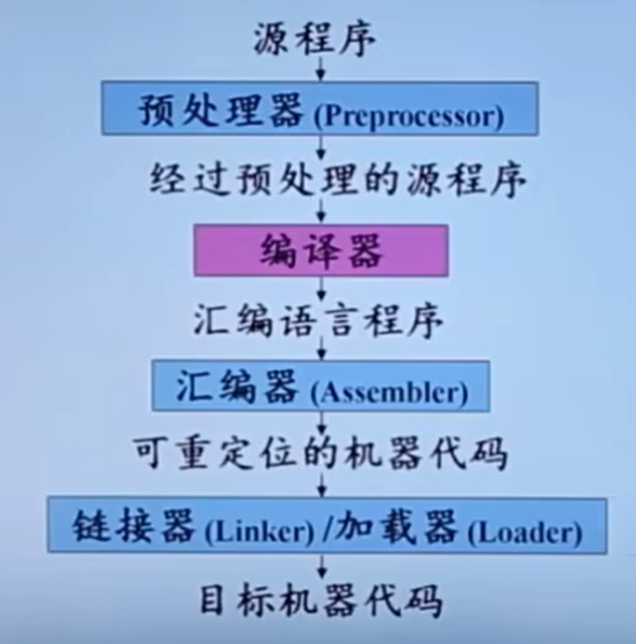

经过编译器和汇编器后得到可重定位(内存中的位置以L为基地址)的机器代码

加载器可以修改重定位地址，将修改后的指令和数据放到内存中适当的位置

链接器负责将机器代码与库文件链接再生成可执行代码。

## 编译系统的结构

以翻译英语为例

词法分析：将源代码中的字符序列分割为有意义的单元(token)，如：关键字，标识符，运算符，常量

语法分析：将token构成语法树，即合法的结构

语义分析：进一步判断予以是否合理。

编译器工作分为多个步骤：

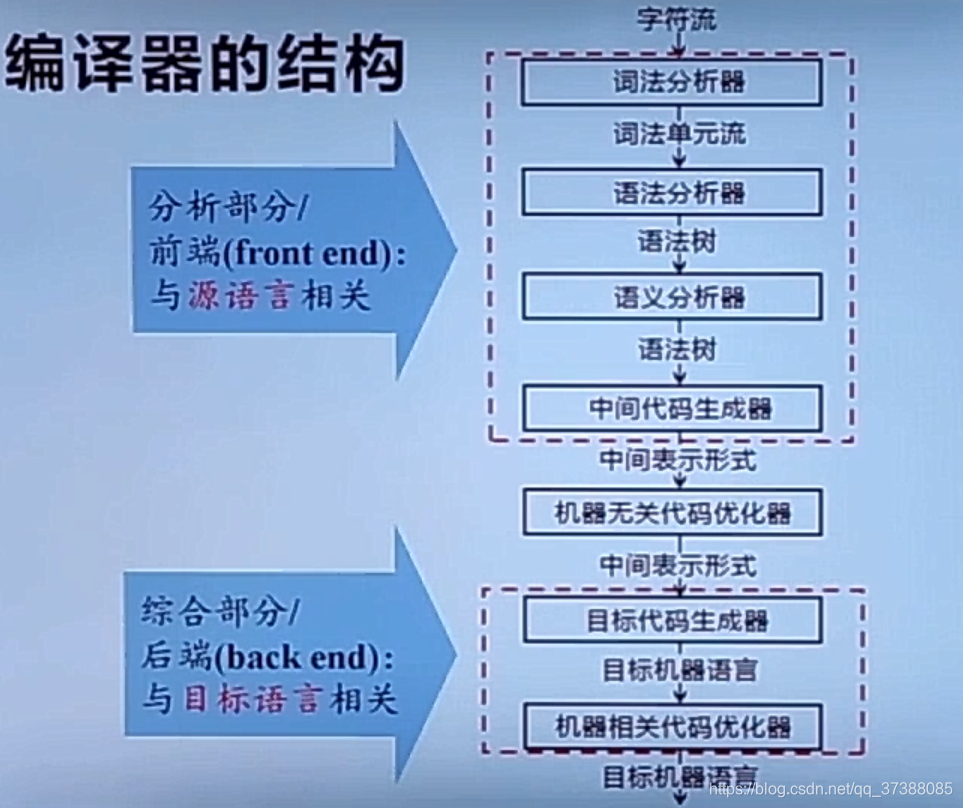

其中，词法分析，语法分析，语义分析，中间代码生成只和**源语言**有关，因此被称为编译器的前端，在源代码的基础上生成中间表示；而后面的部分负责在中间表示的基础上生成目标代码，只与**目标语言有关**，称为后端或者叫综合部分。

中间表示方便编译器**优化和生成**目标代码，常用的中间表示有**三地址码**，它将每一步运算拆成最多只有三个操作数的简单指令，它是四元式的一种表现形式，四元式为(OP，arg1，arg2，result)，即（操作符，操作数1，操作数2，结果）。

例如X =a*b+c/d 的四元式序列

1. `(*, a, b, T1)`
2. `(/, c, d, T2)`
3. `(+, T1, T2, T3)`
4. `(=, T3, -, X)`

# 词法分析

**从左往右逐行扫描源程序的字符**，识别出各个单词，确定单词的类型。将识别出的单词转换为统一的机内表示——词法单元token的形式，token: <种别码，属性值>

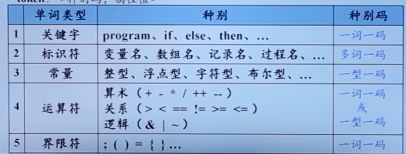

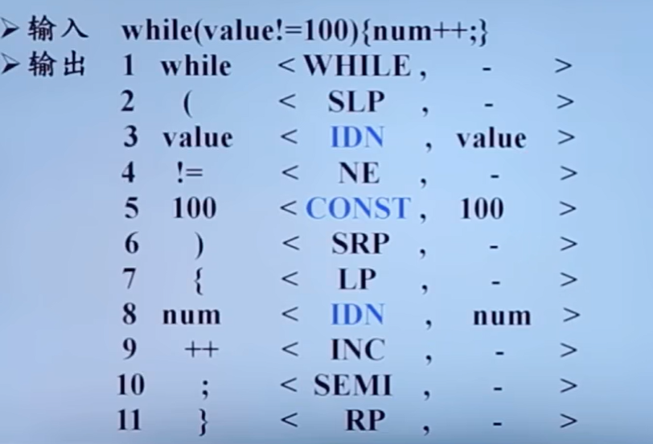

## 基本概念

字母表是一个**有穷符号集合**

字母表的乘积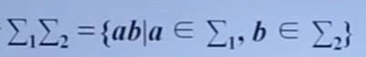，幂运算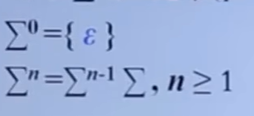

字母表的正闭包等于字母表的正数次幂的并集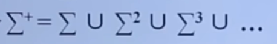

克林闭包就是在正闭包的基础上加一个空串

如果x和y是串，那么xy表示x和y的连接

## 文法的定义

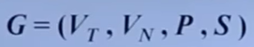

其中：

+ $V_T$：终结符集合，不能再分
+ $V_N$：非终结符集合，可以再分
+ P：产生式集合，将终结符和非终结符组合成串的方法
+ S：开始符号

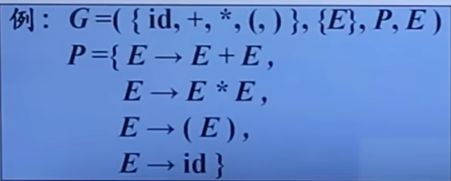

这里的产生式可以将具有相同左部的合并到一起

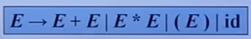

## 语言的定义

句型：从文法的开始符号推到，得到一个可以包含终结符也可以包含非终结符的，也可能是空串的串。

句子：从文法的开始符号推导出的不包含非终结符的串

语言：由文法G的开始符号S推导出的所有句子构成的集合称为文法G生成的语言

## 文法的分类

0型文法：又称无限制文法，产生式的左部至少包含一个非终结符

1型文法：又称上下文有关文法，在0型文法的基础上进一步要求左部的长度不能大于右部的长度，不会产生空串。

2型文法：又称上下文无关文法CFG，产生式的左部是一个非终结符	

3型文法：又称正则文法，分为右线性文法和左线性文法，都是在2型文法的基础上多了一些要求，其中右线性文法规定产生式的右部是一个终结符或者终结符和一个非终结符的；左线性文法规定产生式的右部是终结符或者非终结符和一个终结符。

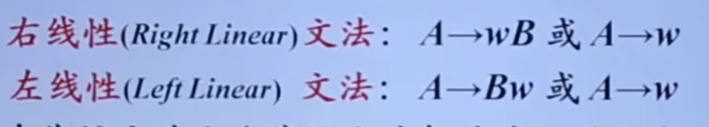																								

四种文法之间的关系

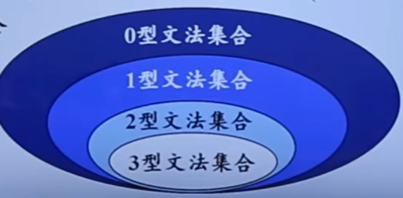

## CFG的分析树

分析树的根节点对应文法的开始符号，内部节点表示一个产生式的应用，叶节点可以是终结符或非终结符。

给定一个句型，其分析树中每一棵子树的边缘称为该句型的一个**短语**

 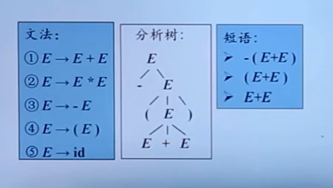

如果该子树的高度为**2**，那么边缘对应的是一个**直接短语**

如果一个文法可以为某个句子生成多棵分析树，则称这个文法是二义性的。

 

# 语法分析

语法分析器：**从词法分析器输出的token序列中识别出各类短语，并构造语法分析树。**

# 语义分析

高级语言程序中的语句大体分为**声明语句和可执行语句**

+ 收集标识符的属性信息(存放在符号表中)

  + 种属：简单变量，符合变量(数组)，过程 

  + 类型

  + 存储位置，长度

  + 值

  + 作用域

+ 语义检查
  + 未申明就是用
  + 重复申明
  + 运算不匹配

